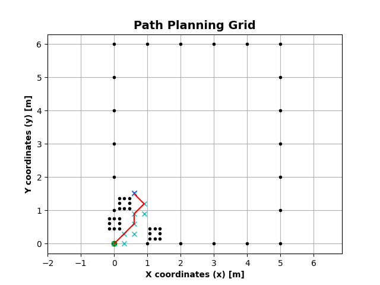

# Lego traversal.robotics Project #1
## Summary/Objective
The objective of this assignment is to navigate a mobile robot through an obstacle course t
location. The start position of the robot as well as the locations of all obstacles and of the
given before the robot is started.
The workspace for the robot is a rectangular area, 3.66 m x 3.05 m in size (this corresponds to
12 x 10 floor tiles in the lab). Obstacles are black cardboard squares 0.305 m x 0.305 m in
size of 1 floor tile) which will be placed in the workspace. The goal is a black circle with a r
0.305 m. To simplify experiments, the center of the goal area, of the obstacles, and of the s
coincide with the intersection point of four floor tiles and their orientation will be aligned
tiles.

## Prerequisites
- A Windows 10 or Mac OS computer
- Internet access and administrator access
- A microSD card
- A mini-USB cable
- Vscode
- `Python 2.7xx` or higher
- LEGO® MINDSTORMS Education EV3 MicroPython Kit
    - The set up for the Lego Ev3 can be found her: https://pybricks.com/ev3-micropython/
- matplotlib

# How to Run / Usage
- Clone this repository
- Follow the steps on how to run programs on the lego ev3 here:https://pybricks.com/ev3-micropython/startbrick.html
- Before running the prgram, configure the `./globals/globals.py` file to match your robot. Here are some variables you should change for your robot:
```
ERROR_FACTOR_DISTANCE = ...
ERROR_FACTOR_TURN = ...
START_POSITION = [0.0001, 0.0001] # x and y pos of the robot [m]
GOAL_POSITION = [3.6,1.8] # x and y pos of goal [m]
NUMBER_OF_OBS = 4 # number of obstacles on grid [#] 
OBS_POSITIONS = [[.915,.305], [.305,1.22], [1.5,1.5], [2.4,1.2]]
```
For variables like the `ERROR_FACTOR_DISTANCE`, it will change depending on what surface the robot travels on. Higher error for rougher surfaces, lower error for smoother surfaces.
- After configuration, you can plug in the lego ev3 robot into your pc, click the `debugger`, then click `Download and run`
- To run on desktop, open a python terminal and run the test.py through Vscode or through the terminal with `python3 -m tests`

# Structure
- Here is the overall project structure:
```
robotics_project
 ┣ globals
 ┃ ┗ globals.py
 ┣ planning
 ┃ ┗ path_planner.py
 ┣ rmath
 ┃ ┣ kinematics.py
 ┃ ┗ micro_numpy.py
 ┣ traversal
 ┃ ┗ robotics.py
 ┣ tests.py
 ┣ main.py
 ┗ readme.md
```
- `planning.path_planner.py` module that plans the robots path using a* search. Below is a sample of what the module returns when running on desktop:  As you can see, each block is .305 x .305 and the `X` markers are nodes found that were possible paths and the red line is the path traversed. YOu can change the grid sizes and workspace of the robot in `./globals/globals.py`. Here is a reference for the implementation of the grid based cell decomp with matplotlib : https://github.com/sponsors/AtsushiSakai. And here is my implementation of A* state based search : https://github.com/AmanHogan/AI_StateSpaceSearches/blob/main/StateSpaceSearches/a_star.py. 
- `globals.globals.py` module which contains the initial paramters of the robot. This is where the number of obstacles, position of onstacles, radius of the robot, and various other constants are initialized. 
- `rmath.kinematics.py` module that performs more complex matrix operations related to rmath.kinematics and converts transforms -> commands and transforms -> matricies
- `rmath.micro_numpy.py` module acts as a replacement for numpy for micropython. Performs basic trig and matrix operations
- `traversal.robotics.py` Acts as a replacement for pybricks.traversal.robotics module. Contains classes for movement and navigation
- `tests.py` runs unit tests and allows you to view the path planned using matplotlib.

## Authors
- Aman Hogan-Bailey
- Sai Karthik Reddy Muddana Laligari
- Trieu Nguyen

## Contributions and Referenes
- The University of Texas at Arlington
- LEGO® MINDSTORMS Education EV3
- Matplot Cell decomp and Obstacle mapper: https://github.com/sponsors/AtsushiSakai
- A* Search: https://github.com/AmanHogan/AI_StateSpaceSearches/blob/main/StateSpaceSearches/a_star.py
