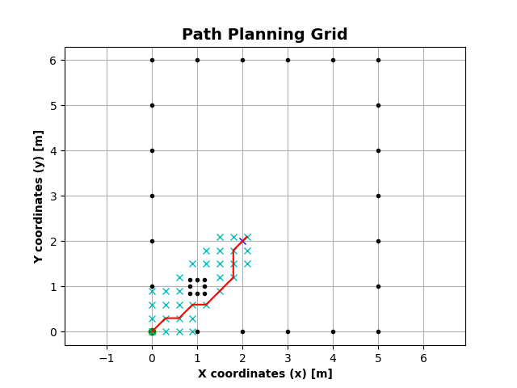

# Lego Robotics Project #1
## Summary/Objective
The objective of this assignment is to navigate a mobile robot through an obstacle course t
location. The start position of the robot as well as the locations of all obstacles and of the
given before the robot is started.
The workspace for the robot is a rectangular area, 3.66 m x 3.05 m in size (this corresponds to
12 x 10 floor tiles in the lab). Obstacles are black cardboard squares 0.305 m x 0.305 m in
size of 1 floor tile) which will be placed in the workspace. The goal is a black circle with a r
0.305 m. To simplify experiments, the center of the goal area, of the obstacles, and of the s
coincide with the intersection point of four floor tiles and their orientation will be aligned
tiles.

## Prerequisites
- A Windows 10 or Mac OS computer
- Internet access and administrator access
- A microSD card
- A mini-USB cable
- Vscode
- `Python 2.7xx` or higher
- LEGO® MINDSTORMS Education EV3 MicroPython Kit
    - The set up for the Lego Ev3 can be found her: https://pybricks.com/ev3-micropython/

# How to Run / Usage
- Clone this repository
- Follow the steps on how to run programs on the lego ev3 here:https://pybricks.com/ev3-micropython/startbrick.html

# Structure
- `path_planner.py` module that plans the robots path using a* search. Below is a sample of what the module returns when running on desktop: 
- `globals.py` module which contains the initial paramters which do not change after compilation. This is where the number of obstacles, position of onstacles, radius of the robot, and various other constants are initialized. 
- `kinematics.py` module that performs more complex matrix operations related to kinematics and converts transforms -> commands and transforms -> matricies
- `micro_numpy.py` module acts as a replacement for numpy for micropython. Performs basic trig and matrix operations
- `robotics.py` Acts as a replacement for pybricks.robotics module. Contains classes for movement and navigation

## Authors
- Aman Hogan-Bailey
- Sai Karthik Reddy Muddana Laligari
- Trieu Nguyen

## Contributions and Referenes
- The University of Texas at Arlington
- LEGO® MINDSTORMS Education EV3
- Matplot and A*: https://github.com/sponsors/AtsushiSakai
- A* Search: https://en.wikipedia.org/wiki/A*_search_algorithm
